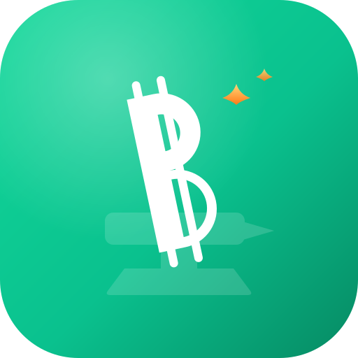

<p align="center">
  
</p>

<h1 align="center">SoloBCH Forge</h1>

<p align="center">
  <strong>Solo mine Bitcoin Cash to your own node — no pool, no fees, no middleman.</strong>
</p>

---

SoloBCH Forge is a lightweight, self-hosted **Bitcoin Cash (BCH) solo-mining Stratum
server** for [Umbrel](https://umbrel.com). Point your ASIC miner at it and mine BCH
directly to your own **Bitcoin Cash Node** — if your hardware finds a block, the full
reward goes straight to your address.

```
ASIC miner (Stratum V1)  →  SoloBCH Forge  →  Bitcoin Cash Node (JSON-RPC)  →  BCH network
```

## Features

**True solo mining**

- **No pool, no fees, no shared rewards** — you against the network. Find a block and
  the entire reward is yours.
- **Address-as-username payouts** — set your miner's Stratum username to your BCH
  address; that address is paid in the coinbase. No server-side wallet, no custody.
- **Works with common ASICs** — NerdQaxe++ / AxeOS, Bitaxe, and other Stratum V1 miners.

**Zero-config on Umbrel**

- **Automatic node connection** — Umbrel hands the app your Bitcoin Cash Node's RPC
  address and password. Nothing to copy, nothing shown in the UI.
- **"Is this working?" diagnostics** — one click checks settings, node, block building,
  the Stratum port, your miner and its shares, stops at the first problem and suggests
  a fix.

**Live dashboard** (behind Umbrel's login, mobile-friendly)

- Node sync status, connected miners, per-worker hashrate and shares.
- Hashrate history chart, all-time best share, and any blocks found.
- Odds panel — network difficulty, block reward, and your expected time-to-block.
- Stats persist across restarts and updates; settings can be exported and restored.

**Built for real mining**

- **Vardiff** — per-worker auto difficulty, and honors the miner's own
  `mining.suggest_difficulty`.
- **Instant new-block jobs** via the node's ZMQ feed, so miners never hash stale work.
- **Fresh templates every 30 seconds** so newly arrived fees are included.
- **Webhook alerts** for block found, new best share, and miner offline.
- **Prometheus `/metrics`** endpoint plus a ready-made [Grafana dashboard](grafana/).

**Light and safe**

- Pure-Python, standard-library Stratum server; small multi-arch image (amd64 + arm64),
  friendly to a Raspberry Pi.
- Stratum port is LAN-only; the node RPC stays on Umbrel's internal network.
- Runs as a non-root user; no block is ever submitted while the node is syncing.

## Requirements

- An **Umbrel** home server (Raspberry Pi or Umbrel Home / x86).
- The **Bitcoin Cash Node** app installed and **fully synced** (required to build real
  blocks; while the node is still syncing the server runs in a safe mock mode).
- A **Stratum V1 ASIC miner** on the same LAN as your Umbrel.

## Install

This app is distributed through a **community app store**. In Umbrel:

1. Open the **App Store**, scroll to the bottom, and choose **Community App Stores**.
2. Add this repository URL:
   ```
   https://github.com/DanCreatesStuff/SoloBCHForge
   ```
3. Open the **SoloBCH App Store** that appears and install **SoloBCH Forge**.

> Requires the **Bitcoin Cash Node** app — Umbrel will list it as a dependency.

## Configure

1. Open **SoloBCH Forge** from your Umbrel dashboard — it lands on the status page.
2. The node connection is automatic: Umbrel hands the app the Bitcoin Cash Node's
   RPC address and password, and the **⚙ Settings** page shows those fields locked.
   (Running outside Umbrel? Enter them there — the password is in the Bitcoin Cash
   Node app's **"Node RPC — for apps"** panel.)
3. Point your miner at SoloBCH Forge:
   - **URL / host:** `stratum+tcp://<your-umbrel-ip>:3334`
   - **Username / worker:** your BCH address, optionally with a worker name —
     `bitcoincash:qxxxxxxxxxxxxxxxxxxxxxxxxxxxxxxxxxxxxxxxxxx.rig1`
   - **Password:** anything (ignored).

Only a valid BCH CashAddr is accepted as the username — a Bitcoin `bc1…` address is
rejected on purpose, since it would be unspendable on BCH. Legacy `1…` addresses are
not accepted either; convert them to CashAddr first. Give each miner its own worker
name (`.rig1`, `.rig2`) so they show as separate rows; worker names may contain
letters, digits, `.`, `_` and `-` only.

## Ports

| Port   | Purpose                        | Exposure                         |
|--------|--------------------------------|----------------------------------|
| `3334` | Stratum (miners connect here)  | Your LAN                         |
| `3335` | Status + settings dashboard    | Umbrel app UI (authenticated)    |

The Bitcoin Cash Node RPC is reached over Umbrel's internal Docker network and is
never exposed to the LAN.

## How solo mining works (read this first)

Solo mining is a **lottery**. With modest hardware you may go a very long time — often
far longer than the hardware's lifetime — without finding a block. When a block *is*
found, you keep the **entire** reward instead of a pool's fractional payout. Run this
for sovereignty, learning, and the lottery ticket — not as an income plan.

No block is ever submitted while the node is syncing or in mock mode; real
`submitblock` calls only happen once your node is fully synced.

## Security

- RPC credentials are entered in the app, stored in the app's private data volume, and
  **never logged or displayed**.
- The Stratum port is LAN-only; the RPC connection stays on Umbrel's internal network.
- The container runs as a non-root user with a minimal image.

## Development

Architecture, phase history, and BCH-specific implementation notes live in
[docs/DEVELOPMENT.md](docs/DEVELOPMENT.md). The multi-arch image is built and pushed to
GHCR by [.github/workflows/docker-publish.yml](.github/workflows/docker-publish.yml) on
each `v*.*.*` tag.

## Disclaimer

Provided **as is**, without warranty of any kind. You are responsible for your node,
your miner, and your funds. You are solely responsible for complying with the laws,
regulations, and tax obligations that apply to cryptocurrency mining in your
jurisdiction. Solo mining is a lottery with no guaranteed reward. This project is not
affiliated with Umbrel, Bitcoin Cash Node, or any miner manufacturer.

## License

[MIT](LICENSE) © 2026 DanCreatesStuff
